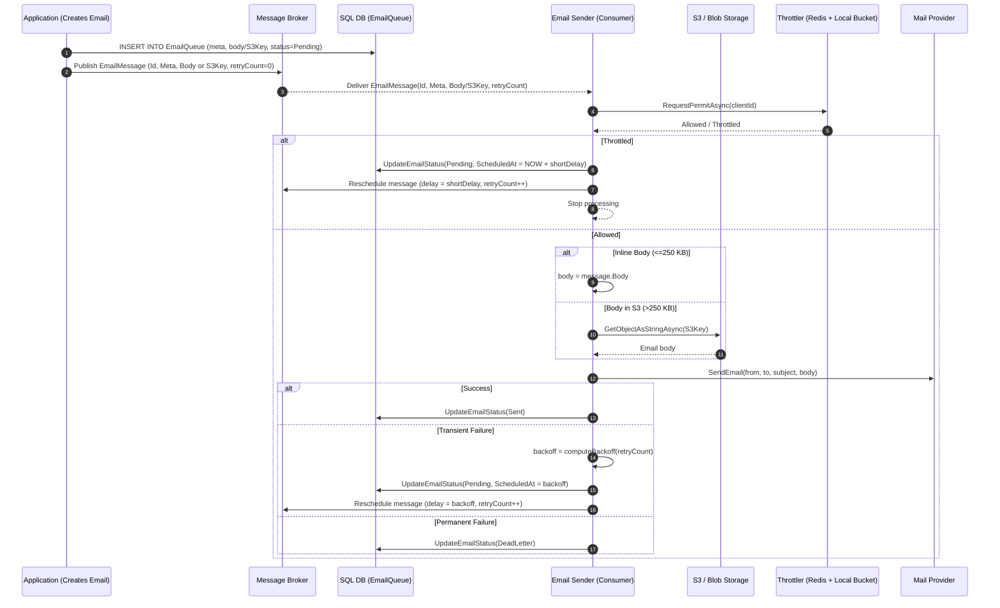
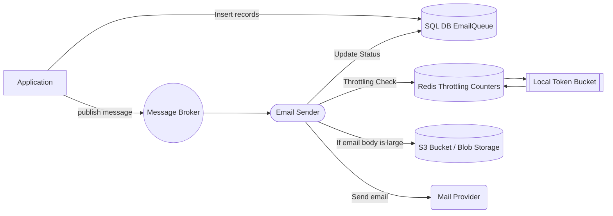
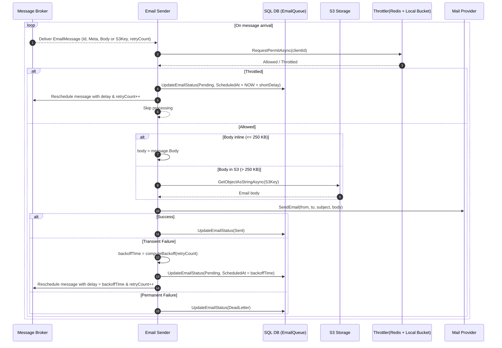
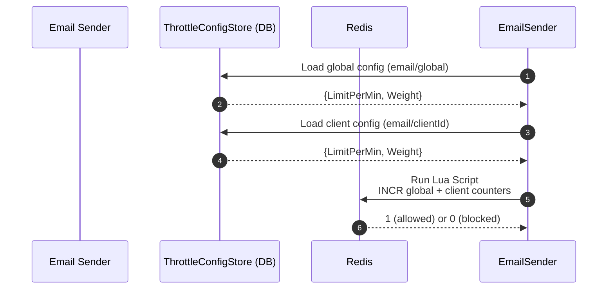
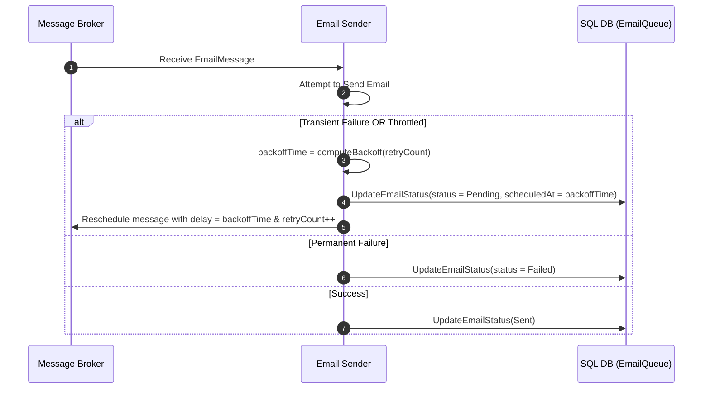

# Email Delivery Architecture

## 1. Use Case Diagram — Email Sending + Throttling + Retry Flow

## 2.Sequence Diagram — Full Email Sending Process With Throttling + Retry

## 3. Sequence Diagram — Throttling Logic Only

## 4. Sequence Diagram — Retry / Backoff Logic

